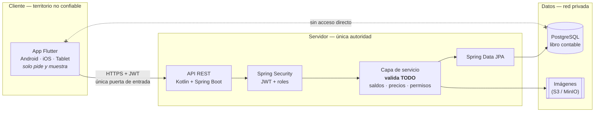
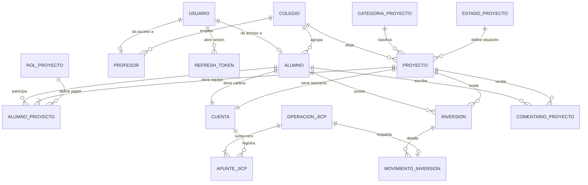

# JICP — Bolsa Social Educativa

Plataforma educativa móvil y tablet (Android + iOS) para aprender **finanzas y economía haciendo**: los alumnos siguen cursos, crean sus propios proyectos/startups y compran participaciones en los proyectos de sus compañeros usando una **moneda ficticia (JICP)**. El profesorado publica cursos, asigna ejercicios y evalúa el desempeño del alumnado.

> **Estado actual:** backend funcional (Kotlin + Spring Boot) con centros, alumnado, profesorado, proyectos, **autenticación JWT**, **libro contable de JICP** y mercado de participaciones. La app Flutter ya usa la API en login, crear proyecto y portafolio; el resto de pantallas siguen con datos simulados (`lib/mock_data.dart`). Este README documenta ambas cosas: lo que ya funciona y la arquitectura objetivo.

> **Principio rector:** la app Flutter **nunca** es la fuente de verdad de un saldo. El cliente muestra datos y solicita operaciones; el servidor decide, ejecuta y devuelve el estado real. Ver [Integridad de la moneda JICP](#integridad-de-la-moneda-jicp).

---

## Tabla de contenidos

- [Concepto](#concepto)
- [Estado del proyecto](#estado-del-proyecto)
- [Stack tecnológico](#stack-tecnológico)
- [Arquitectura](#arquitectura)
- [Integridad de la moneda JICP](#integridad-de-la-moneda-jicp)
- [Estructura del repositorio](#estructura-del-repositorio)
- [Funcionalidades por rol](#funcionalidades-por-rol)
- [Modelo de datos (PostgreSQL)](#modelo-de-datos-postgresql)
- [API REST](#api-rest)
- [Puesta en marcha](#puesta-en-marcha)
- [Diseño y UI](#diseño-y-ui)
- [Roadmap](#roadmap)
- [Convenciones](#convenciones)

---

## Concepto

La aplicación conecta la teoría económica con la práctica dentro de un entorno cerrado y seguro:

1. **Aprender** — el alumno consume cursos de finanzas, economía, emprendimiento y marketing publicados por su profesor.
2. **Crear** — aplica lo aprendido lanzando un proyecto propio, con su descripción, categoría, inversión inicial y desglose de gastos.
3. **Invertir** — usa su saldo en JICP para comprar participaciones en los proyectos del resto de la clase.
4. **Ser evaluado** — el profesor puntúa el trabajo del alumno, y el rendimiento de su cartera alimenta un ranking de aula.

No hay dinero real en ninguna parte del sistema: **JICP es una divisa exclusivamente pedagógica**, sin pasarela de pago ni convertibilidad. Eso no la hace irrelevante: si un alumno puede falsear su saldo, la nota y el ranking dejan de significar nada, así que el sistema se diseña con el mismo rigor contable que una aplicación financiera real.

---

## Estado del proyecto

| Área | Estado | Detalle |
|---|---|---|
| UI alumno (Flutter) | ✅ Implementada | Mercado, cursos, portafolio, crear proyecto, perfil, wallet, comentarios |
| UI profesor (Flutter) | ✅ Implementada | Mercado, gestión de cursos, ranking de alumnos, perfil |
| Navegación y tema | ✅ Implementados | Tema oscuro + dorado, bottom nav por rol |
| Datos | ⚠️ Mixtos | Login, crear proyecto y portafolio usan la API; el resto de pantallas sigue en `MockData` |
| Autenticación | ✅ Conectada | La pantalla de login llama a la API; el rol y la navegación los decide el servidor. Alumno **y profesor** |
| Backend (Kotlin + Spring Boot) | 🚧 En curso | Módulos `colegio`, `alumno`, `profesor`, `proyecto`, `seguridad`, `contabilidad` e `inversion` |
| Base de datos (PostgreSQL) | 🚧 En curso | Migraciones Flyway `V1` a `V6`: esquema, catálogos, equipo, usuario, profesorado y **libro contable** |
| Equipo de proyecto | ✅ Implementado | Creador único, socios y colaboradores, con las reglas en el servidor |
| Autenticación JWT | ✅ Implementado | Login, refresh rotativo y `/yo`. Contraseñas con BCrypt sobre la tabla `usuario` |
| Cierre de la API | 🚧 En curso | Exigen token `/yo`, cartera, portafolio, inversiones, alta de proyectos y comentarios, y alta/edición de profesorado; el resto del CRUD sigue abierto hasta que Flutter migre pantalla a pantalla |
| Contabilidad de JICP | ✅ Implementada | Doble partida, bloqueo pesimista, idempotencia y `CHECK` de saldo. Con test de concurrencia |
| Mercado de participaciones | ✅ Implementado | Crear proyecto con inversión inicial, invertir con precio variable y comentar |
| Layout adaptativo tablet | ⏳ Pendiente | Actualmente optimizado para móvil |
| Tests | 🚧 En curso | 46 de integración en el backend (Testcontainers) y 4 de widget en Flutter |

---

## Stack tecnológico

### Frontend — Flutter

| Pieza | Elección | Notas |
|---|---|---|
| Framework | Flutter (stable) | Android, iOS y tablet desde un único código |
| Lenguaje | Dart `^3.11.4` | Ver `environment` en `pubspec.yaml` |
| UI | Material 3, tema oscuro forzado | Definido en `lib/main.dart` |
| Estado | *Por decidir* — recomendado **Riverpod** | De momento un `ChangeNotifier` suelto (`lib/api/sesion.dart`) para no dar la elección por tomada |
| Navegación | Actualmente `Navigator` imperativo → migrar a **go_router** | Necesario para deep links y guards por rol |
| HTTP | ✅ **dio** + interceptor de JWT | Renueva el token al recibir un `401`. Falta `Idempotency-Key`, que llega con las inversiones |
| Serialización | **freezed** + **json_serializable** | Modelos inmutables desde el contrato de la API |
| Almacenamiento seguro | ✅ **flutter_secure_storage** | Solo tokens. **Nunca saldos** |

### Backend — Kotlin + Spring Boot

| Pieza | Elección |
|---|---|
| Lenguaje | Kotlin 2.x (JDK 21) |
| Framework | Spring Boot 3.x |
| Módulos | Spring Web, Spring Security (JWT), Spring Data JPA, Validation, Actuator |
| Migraciones | Flyway |
| Rate limiting | Bucket4j en endpoints de escritura de moneda |
| Documentación | springdoc-openapi → Swagger UI en `/swagger-ui.html` |
| Build | Gradle (Kotlin DSL) |
| Tests | JUnit 5, MockK, **Testcontainers** con PostgreSQL real (imprescindible para probar concurrencia) |

Kotlin + Spring Boot encaja bien aquí: null-safety y tipado fuerte para reglas de negocio con dinero, `@Transactional` sobre PostgreSQL con bloqueos reales de fila, y un ecosistema de seguridad maduro para roles alumno/profesor y datos de menores.

### Base de datos — PostgreSQL

PostgreSQL 16+, con:
- `NUMERIC(14,2)` para importes y `NUMERIC(14,4)` para participaciones. **Nunca** `float`/`double`.
- Restricciones `CHECK` e índices únicos como última línea de defensa: una invariante en la BBDD sobrevive a cualquier bug de la capa de servicio.
- Transacciones con bloqueo de fila para toda operación que mueva saldo.

---

## Arquitectura

Tres capas, con una única vía de comunicación entre ellas: **la app habla solo con la API, y solo la API habla con la base de datos.**



### El cliente no toca la base de datos

Consecuencias concretas de esa separación, y son verificables en el propio código:

- La app Flutter **no incluye ningún driver de PostgreSQL** ni cadena de conexión, usuario o contraseña de BBDD. Si alguien decompila el APK, no hay credenciales que extraer porque no existen.
- PostgreSQL **no se expone a internet**: escucha solo en la red privada del backend. El `docker-compose` de desarrollo publica el `5432` únicamente en `localhost` de la máquina del desarrollador.
- El único canal es HTTPS contra `/api/v1` con JWT. No hay endpoints alternativos, ni consultas SQL construidas desde el cliente, ni "modo offline" que escriba directamente en ningún sitio.
- Las consultas se hacen con JPA/consultas parametrizadas, nunca concatenando texto que venga del cliente (inyección SQL).
- El servidor valida **cada** petición aunque la app ya lo haya hecho: identidad (JWT), permisos (rol y centro educativo), reglas de negocio (saldo, propiedad, estado del proyecto) y formato. La app no es un punto de control, es una interfaz.

Todo lo que la app "sabe" (saldo, cartera, ranking, notas) es una copia de lectura de lo que el servidor le acaba de decir. Si se borra, se corrompe o se manipula esa copia, la única consecuencia es que la siguiente respuesta del servidor la sobrescribe.

**Capas del backend** (paquete base `com.jicp.api`):

```
com.jicp.api
├── config/           # BCrypt, OpenAPI, CORS (más adelante: rate limiting)    ✅
├── shared/           # excepciones y traducción a RFC 7807                     ✅
├── colegio/          # centros educativos                                      ✅
├── alumno/           # alumnado y sus datos de acceso                          ✅
├── proyecto/         # proyectos + catálogos de categoría y estado             ✅
├── seguridad/        # usuario, JWT, refresh rotativo, filtros                 ✅
├── profesor/         # profesorado y su centro                                 ✅
├── curso/            # cursos, lecciones, matrículas, progreso                 ⏳
├── inversion/        # compras, posiciones y precio de mercado                  ✅
├── contabilidad/     # cuentas, operaciones y apuntes en JICP ← núcleo crítico ✅
└── evaluacion/       # ejercicios, entregas, notas, ranking                    ⏳
```

El módulo `contabilidad` es el único que escribe en `cuenta` y `apunte_jicp`. El resto le piden operaciones semánticas; ninguno modifica un saldo por su cuenta. Esa concentración es lo que permite garantizar de verdad las tres invariantes: doble partida, saldo no negativo e idempotencia.

Cada módulo agrupa las cinco piezas del mismo concepto (entidad, repositorio, servicio, controlador y DTOs) en vez de repartirlas por capas técnicas: al tocar "alumno" se abre una sola carpeta.

---

## Integridad de la moneda JICP

Esta es la parte del sistema donde un error no es un bug cosmético: invalida las notas. El diseño parte de una premisa: **el dispositivo del alumno es territorio hostil**. Puede rootearse, decompilarse, interceptarse con un proxy o sustituirse directamente por `curl`. Por tanto, ninguna garantía puede depender del cliente.

### Resumen de la decisión para este proyecto

| Decisión | Por qué esta y no otra |
|---|---|
| **Servidor autoritativo** | El cliente envía *intenciones* (`invertir en X`), no *resultados* (`mi saldo ahora es Y`) |
| **Libro contable por doble partida** | En una economía cerrada, `SUM(apuntes) = 0` detecta dinero creado de la nada con una sola query |
| **Saldo cacheado + `CHECK (balance >= 0)`** | La restricción de BBDD es una red de seguridad que ningún bug de servicio puede saltarse; no se puede poner un `CHECK` sobre un `SUM()` |
| **Bloqueo pesimista (`SELECT … FOR UPDATE`)** | La contención real es casi nula (una fila por alumno) y es mucho más fácil de razonar que reintentos optimistas |
| **Idempotencia por índice único** | Un `if (existe) return` previo tiene condición de carrera; el índice único no |
| **Tesorería por proyecto** | El dinero invertido va al proyecto, no al bolsillo del creador: si no, lanzar un proyecto sería una forma de vaciar la cartera de los compañeros |
| **El precio lo fija el servidor** | Validar el saldo no sirve de nada si el cliente puede enviar `precio: 0` |

### 1. Server-authoritative: operaciones, no asignaciones

```
❌ MAL   PUT  /cartera { saldo: 999999 }
❌ MAL   POST /inversiones { idProyecto, participaciones: 5, precioUnitario: 0.01, saldoNuevo: 15350 }
✅ BIEN  POST /inversiones { idProyecto, participaciones: 5 }
                            → el servidor calcula precio, importe y saldo
```

Reglas duras:

- **No existe ningún endpoint que acepte un saldo absoluto.** Ni siquiera para admins: un ajuste manual es la operación `ADMIN_ADJUSTMENT`, que genera sus apuntes en el libro y queda firmada con el `id` del admin.
- El `idAlumno` que actúa se extrae **siempre del JWT**, nunca del body ni de la query.
- El precio unitario, el importe, la fecha y el saldo resultante los calcula el servidor. Si vienen en el request, se ignoran.
- La respuesta de toda operación incluye el saldo real resultante, y **ese** es el valor que pinta la UI.

### 2. Modelo de cuentas y libro contable

El saldo no es un campo suelto que se sobrescribe: es el resultado de una secuencia de apuntes inmutables. Toda operación crea una `operacion_jicp` con **dos o más apuntes que suman exactamente cero**.

```
Alumno invierte 750 JICP en "Eco-Drone Delivery"
┌───────────────────────────────────────────────────────────┐
│ operacion_jicp   tipo=INVERSION   actor=alumno_42         │
├───────────────────────────────────────────────────────────┤
│ apunte 1  cuenta=cartera(alumno_42)      importe=-750.00  │
│ apunte 2  cuenta=tesoreria(eco-drone)    importe=+750.00  │
│                                            SUMA =    0.00 │
└───────────────────────────────────────────────────────────┘
```

Tipos de cuenta:

| Tipo | Dueño | Saldo negativo |
|---|---|---|
| `CARTERA_ALUMNO` | Un alumno | ❌ Prohibido por `CHECK` |
| `TESORERIA_PROYECTO` | Un proyecto | ❌ Prohibido por `CHECK` |
| `EMISION_SISTEMA` | El sistema (una sola fila) | ✅ Permitido — su saldo negativo **es** la masa monetaria en circulación |

La cuenta `EMISION_SISTEMA` es la contrapartida cuando se concede saldo inicial a un alumno. Gracias a ella, la creación de dinero también cuadra a cero y queda registrada, en lugar de aparecer por arte de magia.

```sql
CREATE TABLE cuenta (
    id_cuenta      SERIAL PRIMARY KEY,
    tipo           VARCHAR(20) NOT NULL
                   CHECK (tipo IN ('CARTERA_ALUMNO','TESORERIA_PROYECTO','EMISION_SISTEMA')),
    id_alumno      INT REFERENCES alumno(id_alumno),
    id_proyecto    INT REFERENCES proyecto(id_proyecto),
    saldo          NUMERIC(12,2) NOT NULL DEFAULT 0.00,
    fecha_registro TIMESTAMP NOT NULL DEFAULT CURRENT_TIMESTAMP,
    CONSTRAINT saldo_no_negativo CHECK (tipo = 'EMISION_SISTEMA' OR saldo >= 0),
    CONSTRAINT dueno_coherente CHECK (
        (tipo = 'CARTERA_ALUMNO'     AND id_alumno IS NOT NULL AND id_proyecto IS NULL) OR
        (tipo = 'TESORERIA_PROYECTO' AND id_proyecto IS NOT NULL AND id_alumno IS NULL) OR
        (tipo = 'EMISION_SISTEMA'    AND id_alumno IS NULL AND id_proyecto IS NULL)
    )
);
CREATE UNIQUE INDEX ux_cuenta_por_alumno   ON cuenta (id_alumno)   WHERE tipo = 'CARTERA_ALUMNO';
CREATE UNIQUE INDEX ux_cuenta_por_proyecto ON cuenta (id_proyecto) WHERE tipo = 'TESORERIA_PROYECTO';

CREATE TABLE operacion_jicp (
    id_operacion       SERIAL PRIMARY KEY,
    tipo               VARCHAR(30) NOT NULL,
      -- CONCESION_INICIAL | CREACION_PROYECTO | INVERSION | DESINVERSION | RENDIMIENTO | AJUSTE_ADMIN | MIGRACION
    id_alumno_actor    INT NOT NULL REFERENCES alumno(id_alumno),
    id_proyecto        INT REFERENCES proyecto(id_proyecto),
    clave_idempotencia VARCHAR(64) NOT NULL,
    fecha_registro     TIMESTAMP NOT NULL DEFAULT CURRENT_TIMESTAMP,
    CONSTRAINT ux_idempotencia UNIQUE (id_alumno_actor, clave_idempotencia)
);

CREATE TABLE apunte_jicp (
    id_apunte      BIGSERIAL PRIMARY KEY,
    id_operacion   INT NOT NULL REFERENCES operacion_jicp(id_operacion),
    id_cuenta      INT NOT NULL REFERENCES cuenta(id_cuenta),
    importe        NUMERIC(12,2) NOT NULL CHECK (importe <> 0),  -- negativo = sale, positivo = entra
    saldo_posterior NUMERIC(12,2) NOT NULL,
    fecha_registro TIMESTAMP NOT NULL DEFAULT CURRENT_TIMESTAMP
);
CREATE INDEX ix_apunte_por_cuenta ON apunte_jicp (id_cuenta, id_apunte DESC);
```

`apunte_jicp` es **append-only**: sin `UPDATE` ni `DELETE`. Corregir un error es añadir una operación compensatoria, igual que en contabilidad real. El campo `saldo_posterior` da auditoría instantánea ("¿por qué tengo este saldo?") y es fiable precisamente porque el bloqueo de fila serializa los apuntes de cada cuenta.

### 3. Concurrencia: bloqueo pesimista con orden determinista

El caso peligroso no es el fraude sofisticado, es el doble tap: dos peticiones simultáneas leen el mismo saldo de 100, ambas validan "puedo gastar 80" y ambas descuentan. Resultado: −60 y una economía rota.

```kotlin
interface CuentaRepository : JpaRepository<Cuenta, Int> {
    @Lock(LockModeType.PESSIMISTIC_WRITE)          // SELECT … FOR UPDATE
    @Query("select c from Cuenta c where c.id in :ids order by c.id")
    fun bloquear(@Param("ids") ids: List<Int>): List<Cuenta>
}
```

```kotlin
@Service
class ContabilidadService(
    private val cuentas: CuentaRepository,
    private val operaciones: OperacionJicpRepository,
    private val apuntes: ApunteJicpRepository,
) {
    @Transactional
    fun ejecutar(orden: OrdenTransferencia): ResultadoOperacion {
        // 1. Reintento de una operación ya ejecutada → devolvemos el resultado original.
        operaciones.findByAlumnoActorIdAndClaveIdempotencia(orden.idAlumnoActor, orden.claveIdempotencia)
            ?.let { return it.aResultado() }

        // 2. Bloqueo SIEMPRE en orden ascendente de id → dos transferencias cruzadas
        //    no pueden quedarse esperándose mutuamente (deadlock).
        val bloqueadas = cuentas.bloquear(listOf(orden.idCuentaOrigen, orden.idCuentaDestino).sorted())
        val origen  = bloqueadas.first { it.id == orden.idCuentaOrigen }
        val destino = bloqueadas.first { it.id == orden.idCuentaDestino }

        // 3. La validación de negocio vive aquí, no en Flutter.
        if (origen.saldo < orden.importe) throw SaldoInsuficienteException(origen.saldo, orden.importe)

        // 4. Doble partida: los apuntes de una operación suman cero.
        origen.saldo  -= orden.importe
        destino.saldo += orden.importe

        val operacion = operaciones.save(
            OperacionJicp(orden.tipo, orden.idAlumnoActor, orden.idProyecto, orden.claveIdempotencia),
        )
        apuntes.saveAll(listOf(
            ApunteJicp(operacion, origen,  -orden.importe, origen.saldo),
            ApunteJicp(operacion, destino, +orden.importe, destino.saldo),
        ))
        return ResultadoOperacion(operacion.id, saldoResultante = origen.saldo)
    }
}
```

Detalles que importan:

- **Orden de bloqueo determinista.** Con dos cuentas en juego, bloquear "primero la mía, luego la suya" provoca deadlocks en cuanto dos operaciones cruzadas coinciden. Ordenar por `id` lo elimina.
- **El bloqueo debe cubrir la lectura y la escritura dentro de la misma `@Transactional`.** Leer el saldo fuera de la transacción y validar después no sirve de nada.
- La contención es despreciable: se bloquea la fila de una cuenta concreta, no la tabla.

### 4. Idempotencia sin condición de carrera

El cliente genera un UUID v4 por **intento de operación** (no por reintento) y lo envía en la cabecera `Idempotency-Key`. Los reintentos automáticos de `dio` reutilizan la misma clave.

El `findBy…` del ejemplo anterior es un atajo optimista: entre la consulta y el `INSERT` cabe otra petición idéntica. La garantía real la da el índice único `ux_idempotencia`, así que hay que cerrar el círculo:

```kotlin
try {
    return contabilidad.ejecutar(orden)
} catch (e: DataIntegrityViolationException) {
    // Otra petición con la misma clave ganó la carrera: devolvemos SU resultado.
    return operaciones
        .findByAlumnoActorIdAndClaveIdempotencia(orden.idAlumnoActor, orden.claveIdempotencia)!!
        .aResultado()
}
```

Un reintento devuelve **200 con el resultado original**, no un error ni una respuesta vacía: el cliente necesita el saldo resultante para pintar la pantalla.

### 5. Validaciones obligatorias en servidor

Cada una de estas se comprueba en el backend aunque la UI ya lo impida:

- Saldo suficiente (y `CHECK (saldo >= 0)` como red final).
- El precio unitario se lee de `proyecto.precio_participacion` en la BBDD; si el cliente manda un `precioUnitarioEsperado` distinto, se responde `409` en lugar de ejecutar a un precio que el alumno no vio.
- Un alumno **no puede invertir en su propio proyecto**.
- El proyecto está en estado *Publicado* y pertenece al mismo centro que el inversor.
- No se puede vender más participaciones de las que se poseen.
- Importes estrictamente positivos, con `BigDecimal` y `RoundingMode.HALF_UP` explícito.
- Un profesor solo accede a alumnos, cursos y notas de su propio centro educativo.
- `created_at` lo pone el servidor con `now()`; las fechas del cliente se ignoran.
- Rate limiting por usuario en `/inversiones` y demás endpoints de escritura de moneda *(pendiente)*.

### 5 bis. El precio lo marca la demanda

Una participación no cuesta siempre lo mismo. El precio sube a medida que se llena la ronda:

```
precio = precio_base × (1 + participaciones_emitidas / participaciones_totales)
```

Con la ronda vacía se paga el precio base; con la ronda llena, el doble. Se eligió esta curva lineal frente a una compuesta por dos razones: **un alumno puede calcularla a mano** —que es justo lo que se quiere que entienda— y no se dispara sola.

El precio se calcula **una vez por operación** sobre el estado previo, no participación a participación: comprar 5 de golpe paga las 5 al mismo precio. Es un escalón, no una integral, y eso hace que el recibo sea comprobable con una multiplicación.

```
Proyecto con precio_base = 200 y una ronda de 50 participaciones

La fundadora aporta 2000 JICP  →  10 participaciones a 200      emitidas = 10
                                  precio ahora: 200×(1+10/50) = 240
Diego compra 4                 →  4 × 240 = 960 JICP            emitidas = 14
                                  precio ahora: 200×(1+14/50) = 256
```

**El fundador recibe participaciones por su inversión inicial**, al precio base. No se limita a financiar el proyecto: así la tabla de capital cuadra —hay dinero en la tesorería y alguien con derecho sobre él— y el siguiente inversor ya paga por encima del precio base, que es la lección que interesa. La consecuencia es que `inversion_inicial / precio_base` no puede pasar del tamaño de la ronda; si se pide, responde `409`.

`precio_medio` en la posición es la media ponderada de lo pagado. Con precio variable es lo único que permite saber después si la posición gana o pierde, y es lo que alimenta la plusvalía del portafolio.

### 6. Modelo de amenazas

| Lo que intentaría un alumno | Qué lo impide |
|---|---|
| Editar el saldo guardado en el móvil | El saldo local es solo caché de la última respuesta; se descarta y se relee del servidor |
| Interceptar el request con mitmproxy y cambiar el importe | El servidor recalcula importe y saldo; no acepta valores absolutos |
| Llamar a la API con Postman saltándose la app | Mismas validaciones y mismos roles: la app no es un punto de control |
| Poner el `idAlumno` de otro compañero en el body | El actor sale del JWT firmado; el del body se ignora |
| Enviar `precioUnitario: 0.01` | El precio lo lee el servidor de la BBDD |
| Doble tap para duplicar un ingreso | `Idempotency-Key` + índice único |
| Dos peticiones en paralelo para gastar el mismo saldo dos veces | `SELECT … FOR UPDATE` + `CHECK (balance >= 0)` |
| Crear proyectos en bucle para "minar" dinero | Crear un proyecto **descuenta** saldo; además, límite de proyectos por alumno y curso |
| Invertir en su propio proyecto para inflar métricas | Validación de propiedad en el servidor (`409`) |
| Comprar más participaciones de las que quedan en la ronda | `CHECK (participaciones_emitidas <= participaciones_totales)` y validación previa |
| Invertir en el proyecto de otro centro | Se comprueba el colegio del inversor contra el del proyecto (`403`) |
| Decompilar el APK para sacar credenciales de la BBDD | No hay ninguna: la app no se conecta a PostgreSQL, solo a la API |
| Conectarse directamente a PostgreSQL desde fuera | La BBDD no está expuesta a internet; solo el backend la alcanza |
| Rootear o recompilar el APK | Irrelevante: el cliente no tiene ninguna autoridad que robar |

**Lo que NO es una defensa** (y por tanto no se implementa como tal): ofuscación del código Dart, detección de root/jailbreak, certificate pinning o validación en el cliente. Son mitigaciones cosméticas; si la seguridad depende de ellas, el diseño ya está roto. El pinning puede añadirse más adelante contra escucha de red, nunca como sustituto de la autoridad del servidor.

### 7. Reconciliación y auditoría

Tres queries que deben devolver **cero filas** (o cero) siempre. Se ejecutan como job programado (`@Scheduled` diario, alerta si falla) y como test de integración con Testcontainers:

```sql
-- 1. Toda operación cuadra a cero (nadie ha creado ni destruido dinero)
SELECT id_operacion FROM apunte_jicp GROUP BY id_operacion HAVING SUM(importe) <> 0;

-- 2. El saldo cacheado coincide con el libro contable
SELECT c.id_cuenta, c.saldo, a.suma
FROM cuenta c
JOIN (SELECT id_cuenta, SUM(importe) AS suma FROM apunte_jicp GROUP BY id_cuenta) a
  ON a.id_cuenta = c.id_cuenta
WHERE c.saldo <> a.suma;

-- 3. Masa monetaria global: el sistema entero suma exactamente 0
SELECT SUM(importe) FROM apunte_jicp;   -- debe ser 0.00
```

Además, un test de concurrencia obligatorio: 50 peticiones simultáneas de inversión sobre el mismo alumno con saldo justo para una → exactamente una tiene éxito, el saldo nunca queda negativo y el libro sigue cuadrando.

### 8. Qué le toca a Flutter

El cliente aporta buena UX, no seguridad:

- Validar en local (deshabilitar el botón si no hay saldo) **solo** para dar feedback inmediato. La misma validación se repite en el servidor y esa es la que manda.
- Nunca calcular `saldo -= importe` en local. Tras cada operación, pintar el saldo que devuelve el servidor.
- Tratar el saldo como caché de solo lectura con invalidación tras cada operación; nunca como estado propio editable ni persistido en disco.
- Generar `Idempotency-Key` por intento y reutilizarla en los reintentos del interceptor de `dio`.
- Deshabilitar el botón mientras la petición está en vuelo y mostrar estado *pendiente* en lugar de asumir el éxito.
- Ante error de red sin respuesta: **reintentar con la misma clave**, jamás asumir que falló.

---

## Estructura del repositorio

### App Flutter

```
jicpapp/
├── lib/
│   ├── main.dart                      # Entry point, tema y arranque con sesión guardada
│   ├── mock_data.dart                 # Modelos y datos simulados (sustituible por la API)
│   ├── api/                           # Capa de datos contra el backend
│   │   ├── config_api.dart            # URL base, inyectable con --dart-define
│   │   ├── cliente_api.dart           # dio + interceptor de JWT y renovación
│   │   ├── almacen_de_tokens.dart     # flutter_secure_storage; solo tokens
│   │   ├── modelos_auth.dart          # Rol, Tokens, Perfil, ErrorApi
│   │   ├── modelos_proyecto.dart      # Catalogo, ProyectoCreado, ProyectoConRol, Posicion
│   │   ├── repositorio_auth.dart      # login · refresh · logout · /yo
│   │   ├── repositorio_proyectos.dart # categorías · crear · mis proyectos · portafolio · saldo
│   │   └── sesion.dart                # Sesión activa y saldo (ChangeNotifier)
│   └── screens/
│       ├── welcome_screen.dart        # Landing con propuesta de valor
│       ├── login_screen.dart          # Acceso real contra la API (email + contraseña)
│       ├── main_navigation.dart       # Shell de navegación del alumno
│       ├── market_screen.dart         # Mercado, buscador, filtros y detalle de proyecto
│       ├── learning_screen.dart       # Cursos y progreso
│       ├── portfolio_screen.dart      # Mis proyectos e invertidos, contra la API
│       ├── create_project_screen.dart # Alta de proyecto contra la API
│       ├── profile_screen.dart        # Perfil del alumno
│       ├── wallet_detail_screen.dart  # Movimientos de la cartera
│       ├── investment_detail_screen.dart # Historial de compras/ventas
│       ├── comments_screen.dart       # Comentarios de un proyecto
│       └── teacher_navigation.dart    # Shell del profesor + mercado, cursos, ranking, perfil
├── assets/logo.png
├── android/ ios/ web/ windows/ macos/ linux/
└── pubspec.yaml
```

### Backend (monorepo)

Backend y app viven en el mismo repositorio para versionar juntos el contrato de la API:

```
jicpapp/
├── lib/ …                              # App Flutter (raíz del repo)
├── backend/                            # API Kotlin + Spring Boot
│   ├── build.gradle.kts                # Spring Boot 3.5 · Kotlin 2.1 · JDK 21
│   ├── gradlew · gradlew.bat           # Wrapper Gradle 8.14
│   └── src/
│       ├── main/kotlin/com/jicp/api/
│       │   ├── JicpApiApplication.kt
│       │   ├── config/                 # BCrypt, OpenAPI
│       │   ├── shared/                 # excepciones + traducción a RFC 7807
│       │   ├── colegio/                # entidad · repositorio · servicio · controlador · DTOs
│       │   ├── alumno/                 # idem
│       │   ├── profesor/               # idem
│       │   ├── proyecto/               # proyecto, equipo, catálogos y comentarios
│       │   ├── contabilidad/           # cuentas, doble partida y cartera ← núcleo crítico
│       │   ├── inversion/              # compras, posiciones y precio de mercado
│       │   └── seguridad/              # usuario, JWT, refresh rotativo, filtro y config
│       ├── main/resources/
│       │   ├── application.yml
│       │   └── db/migration/           # V1__esquema_inicial.sql … V6__contabilidad.sql
│       └── test/kotlin/com/jicp/api/   # Testcontainers + MockMvc
├── docker-compose.yml                  # PostgreSQL local
└── docs/                               # (pendiente) OpenAPI y decisiones (ADR)
```

---

## Funcionalidades por rol

### Alumno

| Pantalla | Qué hace | Estado |
|---|---|---|
| **Mercado** | Lista de proyectos con buscador y filtro por categoría (Tecnología, Salud, Finanzas, Educación, Media) | UI lista |
| **Detalle de proyecto** | Descripción, desglose de inversión, rendimiento (%), inversión de otros usuarios y hoja de compra | UI lista |
| **Comentarios** | Hilo de comentarios por proyecto | UI lista |
| **Cursos** | Cursos asignados con barra de progreso | UI lista |
| **Portafolio** | Proyectos propios (con su rol y progreso de ronda) e inversiones en ajenos, con plusvalía | ✅ Conectado a la API |
| **Cartera (wallet)** | Saldo en JICP e historial de movimientos (inversión, creación, recarga, venta) | UI lista |
| **Crear proyecto** | Título, descripción, categoría, inversión inicial, precio base y tamaño de ronda | ✅ Conectada a la API: descuenta el saldo y emite participaciones |
| **Perfil** | Nivel, saldo, inversión total, ajustes y cierre de sesión | UI lista; el cierre de sesión ya revoca el token en el servidor |

### Qué pantallas hablan ya con la API

La migración de `MockData` a la API va pantalla a pantalla. Este es el corte exacto, para no perder el hilo entre sesiones:

| Pantalla | Estado | Qué falta |
|---|---|---|
| **Login** | ✅ Conectada | — |
| **Crear proyecto** | ✅ Conectada | Patente e imagen no tienen columna en el backend; el desglose se adjunta a la descripción |
| **Portafolio** | ✅ Conectada | Las tarjetas no navegan: el detalle sigue en mock |
| **Mercado** | ⏳ `MockData` | **Es lo siguiente.** Listar proyectos del centro y comprar participaciones con `POST /inversiones` |
| **Detalle de proyecto** | ⏳ `MockData` | Ficha real + hoja de compra + comentarios (`GET/POST /proyectos/{id}/comentarios`) |
| **Wallet / movimientos** | ⏳ `MockData` | `GET /cartera/movimientos` ya existe y está paginado |
| **Detalle de inversión** | ⏳ `MockData` | Historial de compras de una posición |
| **Comentarios** | ⏳ `MockData` | El backend ya lo soporta entero |
| **Cursos** | ⏳ `MockData` | No hay backend todavía |
| **Perfil** | ⏳ `MockData` | `GET /yo` ya devuelve los datos reales |
| **Todo el profesor** | ⏳ `MockData` | Cursos y ranking no tienen backend |

Notas para retomarlo:

- Las tarjetas del Portafolio **no navegan a propósito**: llevar desde una lista real a un detalle inventado confunde más que no navegar. En cuanto el detalle esté conectado, se les devuelve el `onTap`.
- El fundador aparece en `/portafolio` con las participaciones de sus propios proyectos, porque las tiene de verdad. El Portafolio las separa al pintar (filtrando por los ids de sus proyectos) en lugar de pedirle al servidor que las oculte. Cualquier pantalla nueva que use `/portafolio` tiene que tener esto en cuenta.
- Endpoints ya disponibles y sin usar todavía desde la app: `/proyectos/{id}/mercado`, `/proyectos/{id}/inversores`, `/cartera/movimientos`, `/proyectos/{id}/comentarios`.

### Profesor

| Pantalla | Qué hace | Estado |
|---|---|---|
| **Mercado** | Vista del catálogo de proyectos del alumnado | UI lista |
| **Gestión de cursos** | Listado de cursos, creación de curso y asignación a alumnos concretos | UI lista |
| **Ejercicios** | Añadir ejercicios a un curso | Placeholder (snackbar) |
| **Ranking** | Clasificación por puntuación de inversión y valoración en estrellas | UI lista |
| **Perfil** | Datos del docente, centro educativo, distintivo de verificación | UI lista |

---

## Modelo de datos (PostgreSQL)

Nomenclatura: tablas y columnas en **español y singular**, claves primarias `id_<tabla>` de tipo `SERIAL`, importes en `NUMERIC(12,2)`. Las entidades Kotlin usan los mismos nombres para que no haya capa de traducción mental entre el código y la BBDD.

### Implementado — migraciones `V1` a `V6`



| Tabla | Campos |
|---|---|
| `usuario` | `id_usuario`, `email` (único global), `password` (hash BCrypt), `rol` (`ALUMNO`/`PROFESOR`/`ADMIN`), `activo`, `fecha_registro` |
| `refresh_token` | `id_refresh_token`, `id_usuario` → `usuario`, `hash_token` (SHA-256, único), `fecha_expiracion`, `fecha_revocacion`, `id_sustituto` → `refresh_token` |
| `colegio` | `id_colegio`, `nombre`, `direccion`, `email`, `fecha_registro` |
| `alumno` | `id_alumno`, `nombre`, `apellido`, `id_usuario` → `usuario` (único), `id_colegio` → `colegio`, `jicp_inicial NUMERIC(12,2)`, `fecha_registro` |
| `profesor` | `id_profesor`, `nombre`, `apellido`, `id_usuario` → `usuario` (único), `id_colegio` → `colegio`, `fecha_registro` |
| `proyecto` | `id_proyecto`, `nombre`, `descripcion`, `id_categoria`, `id_estado`, `inversion_inicial`, **`precio_base`**, **`participaciones_totales`**, **`participaciones_emitidas`**, `id_colegio`, `fecha_registro` |
| `cuenta` | `id_cuenta`, `tipo` (`CARTERA_ALUMNO`/`TESORERIA_PROYECTO`/`EMISION_SISTEMA`), `id_alumno`, `id_proyecto`, `saldo NUMERIC(12,2)` con `CHECK` de no negatividad |
| `operacion_jicp` | `id_operacion`, `tipo`, `id_alumno_actor`, `id_proyecto`, `clave_idempotencia` — único por `(actor, clave)` |
| `apunte_jicp` | `id_apunte`, `id_operacion`, `id_cuenta`, `importe`, `saldo_posterior`. **Append-only** |
| `inversion` | `id_inversion`, `id_proyecto`, `id_alumno`, `participaciones NUMERIC(14,4)`, `precio_medio` — único por `(proyecto, alumno)` |
| `movimiento_inversion` | `id_movimiento`, `id_inversion`, `id_operacion`, `tipo`, `participaciones`, `precio_unitario`, `importe` |
| `comentario_proyecto` | `id_comentario`, `id_proyecto`, `id_alumno`, `texto`, `fecha_registro` |
| `alumno_proyecto` | `id_alumno` + `id_proyecto` (PK compuesta), `id_rol` → `rol_proyecto` |
| `categoria_proyecto` | `id_categoria`, `nombre` (único), `descripcion` — catálogo |
| `estado_proyecto` | `id_estado`, `nombre` (único), `descripcion` — catálogo |
| `rol_proyecto` | `id_rol`, `nombre` (único), `descripcion` — catálogo |

**Cómo se reparte la identidad.** Las credenciales no se duplican en cada rol: `usuario` es el único sitio del esquema donde vive un email y una contraseña, y `alumno` y `profesor` cuelgan de ahí con un `UNIQUE (id_usuario)` cada uno.

```
usuario                       ← email UNIQUE global · password (BCrypt) · rol · activo
├── alumno    (id_usuario UNIQUE)   ← nombre, apellido, colegio, jicp_inicial
└── profesor  (id_usuario UNIQUE)   ← nombre, apellido, colegio donde imparte
```

Se eligió así en lugar de repetir email y contraseña en cada tabla porque:

- **El login es una sola consulta.** Con tablas hermanas habría que buscar primero en una y luego en la otra.
- **El email es único de verdad.** Un `UNIQUE` por tabla dejaría que un alumno y un profesor compartieran email, y el login no sabría a quién dejar entrar. Aquí el conflicto se detecta cruzado: dar de alta un profesor con el email de un alumno responde `409`.
- **El `sub` del JWT identifica a la persona, no al rol**, así que el token vale igual sea quien sea quien entra.
- El `rol` va en `usuario` con un `CHECK (rol IN ('ALUMNO','PROFESOR','ADMIN'))`: la base rechaza cualquier valor inventado, no solo la capa de servicio.

Las claves foráneas hacia catálogos y colegio usan `ON DELETE RESTRICT` (no se borra un colegio con alumnos colgando); las de `alumno_proyecto` usan `ON DELETE CASCADE`, porque una participación no tiene sentido sin su alumno ni sin su proyecto.

**El equipo del proyecto.** Un proyecto lo funda un alumno y otros pueden sumarse como socios o colaboradores. La autoría no es una columna de `proyecto`, sino la fila de `alumno_proyecto` con rol *Creador*:

| Rol | id | Significado |
|---|---|---|
| Creador | 1 | Fundó el proyecto. **Exactamente uno** por proyecto |
| Socio | 2 | Participa en el desarrollo y comparte responsabilidad |
| Colaborador | 3 | Apoya el proyecto de forma puntual |

La clave primaria `(id_alumno, id_proyecto)` impide que un alumno figure dos veces en el mismo proyecto, pero **no** impide dos creadores. Eso lo garantiza un índice único parcial:

```sql
CREATE UNIQUE INDEX ux_un_creador_por_proyecto
    ON alumno_proyecto (id_proyecto)
    WHERE id_rol = 1;
```

Por eso los ids del catálogo `rol_proyecto` se fijan a mano en la migración: PostgreSQL exige que el predicado de un índice sea inmutable, así que no admite una subconsulta a `rol_proyecto` y el `1` tiene que ser literal.

`jicp_inicial` es la **concesión inicial**, no el saldo actual. Al dar de alta al alumno se registra como una operación `CONCESION_INICIAL` contra la cuenta `EMISION_SISTEMA`; a partir de ahí el saldo vive en su `cuenta` y es la suma de sus apuntes.

Los catálogos vienen sembrados por migración: cinco categorías que coinciden con los filtros del mercado de la app (Tecnología, Salud, Finanzas, Educación, Media), tres estados (Borrador, Publicado, Cerrado) y los tres roles.

### Pendiente — resto del dominio

| Tabla | Campos destacados |
|---|---|
| `valoracion_proyecto` | `id_valoracion`, `id_proyecto`, `id_profesor`, `estrellas (1-5)` — único por `(id_proyecto, id_profesor)` |
| `curso` · `leccion` · `matricula` | Cursos del profesor, contenido y progreso del alumno |
| `ejercicio` · `entrega` | Enunciados, respuestas, nota y feedback |

Con la contabilidad en marcha, lo que queda por delante son los **cursos** (lecciones, matrículas, ejercicios y entregas), la **valoración del profesorado** y la **desinversión**. Ver [Roadmap](#roadmap).

### Reglas de negocio en el servidor

- Toda compra ejecuta, dentro de **una sola transacción**: bloqueo del proyecto → bloqueo de las cuentas → validación de saldo → apuntes en el libro → emisión de participaciones → actualización de la posición. Si el saldo es insuficiente, `409 Conflict` y nada se escribe.
- **El proyecto se bloquea antes que las cuentas**, y siempre en ese orden. El precio depende de `participaciones_emitidas`, que se muta en la misma operación: sin ese bloqueo, dos compras simultáneas leerían las mismas emitidas, pagarían ambas el precio viejo y podrían pasarse del tamaño de la ronda.
- La creación de un proyecto descuenta la inversión inicial del alumno, la acredita en la tesorería del proyecto y le emite participaciones al precio base. Si no tiene saldo, el proyecto **no llega a existir**: fundar sin fondos no deja un proyecto a medias.
- El saldo nunca puede ser negativo (garantizado por `CHECK`, no solo por código).
- La puntuación del ranking se calcula en el servidor a partir del valor de la cartera y la media de `valoracion_proyecto`. El cliente no envía puntuaciones.
- Un profesor solo accede a alumnos y cursos de su propio centro educativo.

---

## API REST

Prefijo: `/api/v1`. Documentación viva en `http://localhost:8080/swagger-ui.html`.

### Disponible ahora

> ⚠️ **Cierre parcial.** Los endpoints marcados con 🔒 exigen token; el resto del CRUD sigue abierto a propósito, porque las pantallas que aún no están migradas no mandan token y cerrarlos de golpe las dejaría sin backend. Se irán cerrando pantalla a pantalla.

| Método | Endpoint | Descripción |
|---|---|---|
| `POST` | `/api/v1/auth/login` | `{email, password}` → access token, refresh token y rol |
| `POST` | `/api/v1/auth/refresh` | `{refreshToken}` → par nuevo. **Rota**: el presentado queda revocado |
| `POST` | `/api/v1/auth/logout` | `{refreshToken}` → `204`. Revoca el refresh; el access vive hasta caducar |
| `GET` | 🔒 `/api/v1/yo` | Perfil del usuario del token, con sus datos de alumno si lo es |
| `GET` | `/api/v1/colegios?nombre=&page=&size=` | Listado paginado, filtro por nombre |
| `GET` | `/api/v1/colegios/{id}` | Detalle |
| `POST` | `/api/v1/colegios` | Alta |
| `PUT` | `/api/v1/colegios/{id}` | Edición |
| `GET` | `/api/v1/alumnos?idColegio=` | Listado paginado, filtro por colegio |
| `GET` | `/api/v1/alumnos/{id}` | Detalle (nunca devuelve la contraseña) |
| `POST` | `/api/v1/alumnos` | Alta con hash BCrypt; crea su `usuario` y hace de registro. `409` si el email ya existe |
| `PUT` | `/api/v1/alumnos/{id}` | Edición de nombre y apellido |
| `GET` | `/api/v1/alumnos/{id}/proyectos` | Proyectos en los que participa, con su rol en cada uno |
| `GET` | `/api/v1/profesores?idColegio=` | Listado paginado, filtro por centro |
| `GET` | `/api/v1/profesores/{id}` | Detalle (nunca devuelve la contraseña) |
| `POST` | 🔒 `/api/v1/profesores` | **Solo un profesor.** Alta de un compañero en su propio centro; `409` si el email ya existe |
| `PUT` | 🔒 `/api/v1/profesores/{id}` | **Solo un profesor**, y solo sobre alguien de su mismo centro |
| `GET` | `/api/v1/proyectos?idColegio=&idCategoria=&idEstado=` | Mercado paginado con filtros opcionales, cada uno con su creador |
| `GET` | `/api/v1/proyectos/{id}` | Detalle con categoría, estado, colegio y creador |
| `POST` | 🔒 `/api/v1/proyectos` | **Solo alumno.** El creador sale del token; descuenta la inversión inicial y abre la tesorería |
| `PUT` | `/api/v1/proyectos/{id}` | Edición |
| `GET` | `/api/v1/proyectos/{id}/miembros` | Equipo: creador, socios y colaboradores |
| `POST` | `/api/v1/proyectos/{id}/miembros` | Añadir socio o colaborador `{idAlumno, idRol}` |
| `PUT` | `/api/v1/proyectos/{id}/miembros/{idAlumno}` | Cambiar el rol de un miembro |
| `DELETE` | `/api/v1/proyectos/{id}/miembros/{idAlumno}` | Sacar a un miembro del proyecto |
| `GET` | `/api/v1/categorias` | Catálogo para los filtros del mercado |
| `GET` | `/api/v1/estados-proyecto` | Catálogo de estados |
| `GET` | `/api/v1/roles-proyecto` | Catálogo de roles del equipo |
| `POST` | 🔒🔑 `/api/v1/inversiones` | **Solo alumno.** Comprar `{idProyecto, participaciones, precioUnitarioEsperado?}` |
| `GET` | 🔒 `/api/v1/cartera` | Saldo actual del alumno del token (**solo lectura**) |
| `GET` | 🔒 `/api/v1/cartera/movimientos` | Apuntes del libro contable, paginados |
| `GET` | 🔒 `/api/v1/portafolio` | Posiciones del alumno, valoradas a precio de hoy |
| `GET` | `/api/v1/proyectos/{id}/mercado` | Precio actual, emitidas, disponibles y recaudado |
| `GET` | `/api/v1/proyectos/{id}/inversores` | Quién tiene participaciones del proyecto |
| `GET` | `/api/v1/proyectos/{id}/comentarios` | Hilo de comentarios, paginado |
| `POST` | 🔒 `/api/v1/proyectos/{id}/comentarios` | **Solo alumno**, y de su propio centro |

Reglas que aplica el servidor sobre el equipo, todas devolviendo `409`:

- El **colegio del proyecto se deriva del alumno creador**, no se envía en la petición: así no puede darse de alta un proyecto en un centro distinto al de su autor.
- Un alumno de otro colegio no puede unirse al proyecto.
- Un alumno no puede participar dos veces en el mismo proyecto.
- El rol *Creador* no se concede después del alta ni se transfiere, y el creador no puede degradarse ni abandonar su proyecto. De la autoría cuelgan la propiedad y, más adelante, la tesorería del proyecto.

Reglas sobre el profesorado:

- **A un profesor lo da de alta otro profesor.** No hay figura de administrador en este producto —la app solo tiene alumnado y profesorado—, así que custodiar el endpoint con un rol `ADMIN` sería inventarse una persona que no existe en ninguna pantalla.
- **El centro se hereda de quien da el alta**, igual que el colegio de un proyecto sale de su alumno creador. No se envía en la petición: si viniera en el body, un docente podría darse de alta compañeros en un centro que no es el suyo.
- Editar a alguien de otro centro devuelve `403`, no `404`: el recurso existe, lo que falta es permiso.
- Un token de alumno sobre estos endpoints devuelve `403`; sin token, `401`.

Estos dos endpoints están cerrados mientras el resto del CRUD sigue abierto, y es deliberado: **dejar abierta la creación de credenciales no es lo mismo que dejar abierta la lectura de un catálogo**.

Los listados devuelven la envoltura `Page` de Spring (`content`, `totalElements`, `totalPages`, `number`, `size`) y aceptan `?page=0&size=20&sort=campo,asc`.

### Operaciones con moneda

🔑 marca los endpoints que exigen la cabecera **`Idempotency-Key`**. El cliente genera un UUID v4 por **intento de compra** —no por reintento— y lo reutiliza en todos los reintentos de ese intento. Sin esa cabecera se responde `409`: un doble toque, o el reintento de una petición cuya respuesta se perdió, compraría dos veces.

Un reintento con la misma clave devuelve **`200` con el recibo original**, no un error ni una respuesta vacía: el cliente necesita el saldo para pintar la pantalla.

```http
POST /api/v1/inversiones
Authorization: Bearer <jwt>
Idempotency-Key: 3f6c1e7a-9b2d-4f8e-a1c5-77d0b2e4a913
Content-Type: application/json

{ "idProyecto": 12, "participaciones": 4 }
```

```json
{
  "idOperacion": 8,
  "idProyecto": 12,
  "nombreProyecto": "Huerto Urbano Escolar",
  "participacionesCompradas": 4.0000,
  "precioUnitario": 240.0000,
  "importe": 960.00,
  "participacionesTotales": 4.0000,
  "precioMedio": 240.0000,
  "precioSiguiente": 256.0000,
  "saldoCartera": 14040.00
}
```

El `saldoCartera` de la respuesta es el saldo real tras la operación, y **es el que debe pintar la UI**. La app nunca calcula `saldo -= importe` por su cuenta.

Lo que rechaza el servidor, todo con el detalle en `problem+json`:

| Situación | Código |
|---|---|
| Sin token | `401` |
| Rol distinto de alumno, o proyecto de otro centro | `403` |
| Saldo insuficiente | `409` |
| Invertir en el proyecto propio | `409` |
| `precioUnitarioEsperado` distinto del actual | `409` |
| Más participaciones de las que quedan en la ronda | `409` |
| Falta `Idempotency-Key` | `409` |
| Participaciones ≤ 0 o con más de 4 decimales | `422` |

### Autenticación

Las credenciales no cuelgan de `alumno`, sino de una tabla **`usuario`** de la que penden `alumno` y `profesor`. Así el login es una sola consulta, el email es único en todo el sistema (un alumno y un profesor no pueden compartirlo) y el `sub` del JWT identifica a la persona con independencia del rol.

**Alumnado y profesorado entran por el mismo endpoint.** No hay un `/auth/login-profesor`: se manda el mismo par email/contraseña y es el servidor quien responde con el rol. `GET /yo` devuelve entonces el bloque `alumno` o el bloque `profesor`, nunca los dos.

```
POST /api/v1/auth/login   { "email": "ana@ies.example", "password": "..." }

{
  "accessToken":  "eyJhbGciOiJIUzI1NiJ9...",
  "refreshToken": "b3RyYSBjb3NhIGFsZWF0b3JpYQ",
  "expiraEn": 900,
  "rol": "ALUMNO",
  "idUsuario": 42
}
```

| Token | Vida | Dónde vive | Se puede revocar |
|---|---|---|---|
| **Access** (JWT HS256) | 15 min | En ninguna parte del servidor: se verifica por firma | ❌ No, por eso dura poco |
| **Refresh** (256 bits aleatorios) | 30 días | Tabla `refresh_token`, como SHA-256 | ✅ Sí, y **rota en cada uso** |

Decisiones y su porqué:

- **El JWT lleva lo mínimo** — `sub` (id de usuario), `rol` y `email`. Ni saldo, ni nombre, ni nada que pueda quedarse obsoleto: el cliente no debe poder leer del token nada que el servidor considere autoritativo.
- **Refresh rotativo con detección de reutilización** — cada renovación quema el token presentado y emite otro. Si alguien presenta uno ya rotado, o lo han robado o el cliente guardó una copia vieja; como no hay forma de saber cuál de los dos es el legítimo, **se revocan todas las sesiones del usuario** y a entrar de nuevo.
- **Del refresh token se guarda su SHA-256, no su valor** — quien consiga leer la tabla no puede renovar la sesión de nadie. No lleva BCrypt porque el valor ya son 256 bits de `SecureRandom`: no hay nada que ralentizar frente a fuerza bruta, y un hash determinista se busca por índice en una consulta.
- **Un único `401` para email desconocido, contraseña incorrecta y cuenta desactivada** — distinguirlos le confirmaría a quien prueba credenciales que ha acertado una de las dos partes. Por el mismo motivo, cuando el email no existe se compara igualmente contra un hash señuelo: si no, el tiempo de respuesta sería un oráculo de qué cuentas están dadas de alta.
- **El secreto de firma llega por `JWT_SECRET`** — hay un valor por defecto de desarrollo en `application.yml` para poder levantar la API sin configurar nada, y el arranque **avisa por log** si se queda con él.

El `403` y el `401` salen también en `application/problem+json`: los rechazos de Spring Security ocurren en la cadena de filtros, antes de que exista controlador, así que tienen su propio `AuthenticationEntryPoint` en lugar de caer en la página de error HTML por defecto.

> **Todavía no existe `POST /auth/registro`.** El alta de alumno (`POST /api/v1/alumnos`) ya crea su `usuario`, así que hacer un segundo camino para crear credenciales solo añadiría superficie que asegurar. El profesorado ya existe, pero ese endpoint **sigue abierto**: queda pendiente que pase a exigir rol de profesor.

### Diseño completo

Autenticación por **JWT Bearer**; refresh token rotativo. Todos los endpoints marcados con 🔑 exigen la cabecera `Idempotency-Key: <uuid>`.

| Método | Endpoint | Rol | Descripción |
|---|---|---|---|
| `POST` | `/auth/registro` | público | Alta de usuario — *de momento lo cubre `POST /alumnos`* |
| ✅ `POST` | `/auth/login` | público | Devuelve access + refresh token |
| ✅ `POST` | `/auth/refresh` | público | Rota el refresh y renueva el access token |
| ✅ `POST` | `/auth/logout` | público | Revoca el refresh token |
| ✅ `GET` | `/yo` | autenticado | Perfil del usuario del token, con su bloque de alumno o de profesor |
| `PATCH` | `/yo` | autenticado | Editar el propio perfil |
| ✅ `GET` | `/proyectos/{id}/comentarios` | público | Comentarios |
| ✅ `POST` | `/proyectos/{id}/comentarios` | alumno | Comentar |
| `POST` | `/proyectos/{id}/valoraciones` | profesor | Valorar con estrellas |
| ✅ `POST` | 🔑 `/inversiones` | alumno | Comprar `{idProyecto, participaciones, precioUnitarioEsperado?}` |
| `POST` | 🔑 `/inversiones/{id}/venta` | alumno | Vender `{participaciones, precioUnitarioEsperado?}` |
| ✅ `GET` | `/cartera` | alumno | Saldo actual (**solo lectura**) |
| ✅ `GET` | `/cartera/movimientos` | alumno | Apuntes del libro contable, paginados |
| ✅ `GET` | `/portafolio` | alumno | Posiciones valoradas a precio de hoy |
| `POST` | 🔑 `/admin/ajustes` | admin | Ajuste manual → queda como `AJUSTE_ADMIN` firmado |
| `GET` | `/cursos` | autenticado | Cursos del alumno / del profesor |
| `POST` | `/cursos` | profesor | Crear curso |
| `POST` | `/cursos/{id}/matriculas` | profesor | Asignar curso a alumnos |
| `PATCH` | `/matriculas/{id}/progreso` | alumno | Actualizar progreso |
| `POST` | `/cursos/{id}/ejercicios` | profesor | Añadir ejercicio |
| `POST` | `/ejercicios/{id}/entregas` | alumno | Entregar ejercicio |
| `PATCH` | `/entregas/{id}` | profesor | Calificar y dar feedback |
| `GET` | `/ranking` | autenticado | Ranking de aula/centro (calculado en servidor) |

El `POST /proyectos` ya descuenta la inversión inicial de la cartera del autor. Todavía **no** exige 🔑: la clave natural es el propio id del proyecto, que no existe hasta haberlo creado, así que la idempotencia de esa alta necesita su propia vuelta.

**No existe** `PUT /cartera` ni ningún endpoint que reciba un saldo. Es una ausencia deliberada.

Ejemplo de compra:

```http
POST /api/v1/inversiones
Authorization: Bearer <jwt>
Idempotency-Key: 3f6c1e7a-9b2d-4f8e-a1c5-77d0b2e4a913
Content-Type: application/json

{ "idProyecto": 12, "participaciones": 5, "precioUnitarioEsperado": 150.00 }
```

```json
{
  "idOperacion": 5821,
  "participaciones": 5,
  "precioUnitario": 150.00,
  "importe": 750.00,
  "saldoCartera": 14650.50
}
```

Códigos de estado relevantes:

| Código | Cuándo |
|---|---|
| `401` | Credenciales incorrectas, token ausente, caducado o manipulado, o refresh ya rotado |
| `403` | Token válido, pero el rol no alcanza para el recurso |
| `409` | Saldo insuficiente, precio cambiado respecto a `precioUnitarioEsperado`, o inversión en proyecto propio |
| `422` | Validación de formato (importes ≤ 0, campos obligatorios) |
| `429` | Rate limit superado |

Errores en formato RFC 7807 (`application/problem+json`).

---

## Puesta en marcha

### Requisitos

- Flutter SDK (canal *stable*) con Dart `^3.11.4` — `flutter doctor` sin errores
- Android Studio / Xcode para emuladores
- JDK 21 y Docker (para el backend)

### App Flutter

```bash
flutter pub get
flutter run                       # dispositivo o emulador conectado
flutter devices                   # ver dispositivos disponibles
flutter run -d <device_id>
```

Comprobaciones:

```bash
flutter analyze
flutter test
```

Builds de release:

```bash
flutter build apk --release              # Android
flutter build appbundle --release        # Google Play
flutter build ipa --release              # iOS (requiere macOS + Xcode)
```

### Conectar la app al backend

La app ya inicia sesión contra la API. Con el backend levantado (ver más abajo), basta con:

```bash
flutter run -d windows      # escritorio: lo más directo para probar
flutter run -d chrome       # web: necesita el CORS de desarrollo, ya configurado
flutter run                 # móvil o emulador
```

La URL base se resuelve sola en desarrollo: `10.0.2.2:8080` en el emulador de Android (que es como el emulador ve al PC anfitrión) y `localhost:8080` en el resto. Para apuntar a otra máquina —por ejemplo un móvil físico contra tu portátil— se inyecta en compilación:

```bash
flutter run --dart-define=API_BASE_URL=http://192.168.1.50:8080/api/v1
```

Detalles que conviene saber:

- **Android bloquea el HTTP sin cifrar desde API 28.** El permiso está abierto **solo** en `android/app/src/debug/AndroidManifest.xml`, que no entra en las builds de release: la app publicada sigue exigiendo HTTPS. Si estuviera en el manifest principal, cualquiera en la misma red podría leer los tokens en claro.
- **En web hay CORS.** El backend permite orígenes de `localhost` en cualquier puerto (Flutter web usa uno aleatorio). Cualquier otro origen recibe `403`. Se amplía con la variable `CORS_ORIGENES`.
- **Un móvil físico contra tu PC** necesita además abrir el puerto 8080 en el firewall, y que ambos estén en la misma red. Ten en cuenta que los CRUD siguen sin autenticación.

### Qué hace la app con la sesión

- El **rol lo decide el servidor**: la respuesta de `/auth/login` determina si se entra a la vista de alumno o a la de profesor. La app no elige con qué permisos entra.
- Los tokens se guardan en el **almacén cifrado del sistema** (Keystore/Keychain). Nunca se guarda un saldo: el saldo es del servidor.
- Al recibir un `401`, el interceptor **renueva el token una sola vez** y repite la petición. Las renovaciones simultáneas comparten un único `Future` a propósito: como el servidor rota el refresh en cada uso y trata un token ya rotado como robado, dos renovaciones en paralelo cerrarían la sesión entera.
- Si la renovación falla, se borran los tokens y la app vuelve a la pantalla de acceso.
- Al arrancar, si hay una sesión guardada se valida contra `GET /yo` antes de dar por buena. Un fallo de red lleva a la portada: sin poder confirmar quién eres, la app no da por buena ninguna sesión.

El login de profesor ya funciona igual que el de alumno: mismo formulario, mismo endpoint, y es la respuesta del servidor la que lleva a una vista o a la otra.

### Backend

1. **Levantar PostgreSQL** (desde la raíz del repo):

   ```bash
   docker compose up -d db
   ```

   El contenedor publica el puerto solo en `127.0.0.1`, así que la base no queda accesible desde la red local.

2. **Arrancar la API** (Flyway crea el esquema y siembra los catálogos en el primer arranque):

   ```bash
   cd backend
   ./gradlew bootRun            # Windows: .\gradlew.bat bootRun
   ```

   Disponible en `http://localhost:8080`, con Swagger UI en `/swagger-ui.html` y `/actuator/health`.

3. **Tests** (levantan su propio PostgreSQL con Testcontainers, requiere Docker en marcha):

   ```bash
   ./gradlew test
   ```

#### El primer profesor

Si a un profesor solo lo puede dar de alta otro profesor, el primero no puede nacer por la API. La salida habitual —dejar el endpoint abierto «solo al principio»— deja una puerta que nadie se acuerda de cerrar después, así que aquí la abre **quien administra el servidor, no quien llega por red**:

```bash
JICP_PROFESOR_INICIAL_EMAIL=jefatura@ies.example \
JICP_PROFESOR_INICIAL_PASSWORD=una-contrasena-larga \
JICP_PROFESOR_INICIAL_ID_COLEGIO=1 \
./gradlew bootRun
```

Solo se ejecuta si **no existe ningún profesor todavía**, de modo que no sirve para colar una cuenta en un sistema ya en marcha. Hace falta poder poner variables de entorno en la máquina, que es precisamente la barrera que se busca. A partir de ahí, las altas van por `POST /api/v1/profesores`.

La contraseña no vive en el repositorio ni en ninguna migración a propósito: **una credencial versionada es una credencial pública**.

Configuración por variables de entorno, con valores por defecto para desarrollo local:

| Variable | Defecto |
|---|---|
| `DB_URL` | `jdbc:postgresql://localhost:5432/jicp` |
| `DB_USER` | `jicp` |
| `DB_PASSWORD` | `jicp` |
| `SERVER_PORT` | `8080` |
| `JWT_SECRET` | secreto de desarrollo (mínimo 32 bytes; **obligatorio fuera de localhost**) |
| `JICP_PROFESOR_INICIAL_EMAIL` · `_PASSWORD` · `_ID_COLEGIO` | vacío — crea el primer profesor solo si no hay ninguno |
| `CORS_ORIGENES` | vacío — orígenes extra permitidos, además de `localhost` |

Prueba rápida de humo:

```bash
curl http://localhost:8080/api/v1/categorias

curl -X POST http://localhost:8080/api/v1/colegios \
  -H "Content-Type: application/json" \
  -d '{"nombre":"IES Ejemplo","direccion":"Calle Mayor 1","email":"info@ies.example"}'
```

Y el circuito completo de login: alta de alumno, entrada y consulta del propio perfil.

```bash
curl -X POST http://localhost:8080/api/v1/alumnos \
  -H "Content-Type: application/json" \
  -d '{"nombre":"Ana","apellido":"Martinez","email":"ana@ies.example",
       "password":"contrasena-larga","idColegio":1,"jicpInicial":10000.00}'

TOKEN=$(curl -s -X POST http://localhost:8080/api/v1/auth/login \
  -H "Content-Type: application/json" \
  -d '{"email":"ana@ies.example","password":"contrasena-larga"}' | jq -r .accessToken)

curl http://localhost:8080/api/v1/yo -H "Authorization: Bearer $TOKEN"
```

> El esquema lo gobierna Flyway y Hibernate arranca con `ddl-auto: validate`: si una entidad deja de coincidir con su tabla, la aplicación **no arranca** en vez de corromper datos en silencio. Cada cambio de modelo necesita su migración `V…__descripcion.sql`; las migraciones ya aplicadas no se editan nunca.

---

## Diseño y UI

Identidad visual definida en [main.dart](lib/main.dart):

| Token | Valor | Uso |
|---|---|---|
| Primario | `#D4AF37` (dorado) | Acentos, iconos, CTAs |
| Secundario | `#B8901D` | Estados hover/pressed |
| Fondo | `#0A0A0A` | Scaffold |
| Superficie | `#151515` | Barras y contenedores |
| Superficie elevada | `#222222` | Tarjetas |

La app fuerza `ThemeMode.dark` y usa Material 3. Pendiente para tablet: puntos de ruptura responsive (lista + detalle en dos paneles a partir de ~840 dp) y layouts en rejilla para el mercado.

---

## Roadmap

**Fase 1 — Prototipo** ✅
- [x] Pantallas del alumno con datos simulados
- [x] Pantallas del profesor con datos simulados
- [x] Sistema de diseño oscuro/dorado

**Fase 2 — Backend y contabilidad**
- [x] Proyecto Spring Boot + Gradle KTS en `backend/`
- [x] Esquema inicial con Flyway: `colegio`, `alumno`, `proyecto` y catálogos
- [x] CRUD de colegios, alumnos y proyectos con validación y errores RFC 7807
- [x] Equipo del proyecto (`alumno_proyecto`): creador, socios y colaboradores
- [x] Contraseñas hasheadas con BCrypt
- [x] Tests de integración con Testcontainers
- [x] Tabla `usuario` unificada: email único global, rol y contraseña fuera de `alumno`
- [x] Autenticación JWT: login, refresh rotativo con detección de reutilización, logout y `/yo`
- [x] Tabla `profesor` y su CRUD, de la que dependen cursos, evaluación y ranking
- [x] Alta y edición de profesorado cerradas con `@PreAuthorize` y centro tomado del token
- [ ] Cerrar el resto de CRUD con `@PreAuthorize` y tomar el actor del token en vez del body
- [x] Módulo de contabilidad: cuentas, doble partida, bloqueo pesimista e idempotencia
- [x] Restricciones `CHECK` de saldo y consultas de reconciliación (como test)
- [x] Mercado: crear proyecto con inversión inicial, invertir con precio variable y comentar
- [x] Test de concurrencia: 50 compras simultáneas con saldo para una
- [ ] Job de reconciliación programado (`@Scheduled`) con alerta
- [ ] Desinversión: vender participaciones
- [ ] Cursos, lecciones, matrículas, ejercicios y entregas
- [ ] OpenAPI publicado y versionado en `docs/`

**Fase 3 — Integración (actual)**
- [x] Capa de datos en Flutter (`lib/api/`) con dio y almacenamiento seguro de tokens
- [x] Interceptor de JWT con renovación automática al recibir `401`
- [x] Login real: el rol y la navegación los decide el servidor
- [x] Cierre de sesión que revoca el refresh token en el backend
- [x] Crear proyecto contra la API, con saldo real y confirmación de participaciones
- [x] Portafolio contra la API: proyectos propios con su rol, e inversiones con plusvalía
- [ ] **Mercado contra la API**: listar proyectos del centro y comprar participaciones ← siguiente
- [ ] Detalle de proyecto: ficha real, hoja de compra y comentarios
- [ ] Wallet y detalle de inversión desde `/cartera/movimientos`
- [ ] Perfil desde `GET /yo`
- [ ] `Idempotency-Key` en las operaciones de moneda
- [ ] Gestión de estado (Riverpod) y `go_router` con guards por rol
- [ ] Saldo y cartera renderizados exclusivamente desde respuestas del servidor
- [ ] Subida de imágenes de proyecto

**Fase 4 — Producto**
- [ ] Layouts adaptativos para tablet
- [ ] Evaluación completa: ejercicios, entregas y calificaciones
- [ ] Ranking calculado en servidor y notificaciones push
- [ ] Rate limiting con Bucket4j en endpoints de moneda
- [ ] Tests: unitarios y de widget en Flutter, y ampliar los de integración (el de concurrencia del backend ya está)
- [ ] Publicación en Google Play y App Store

---

## Convenciones

- **Idioma**: el dominio se nombra en **español y en singular** (`alumno`, `proyecto`, `inversionInicial`), igual en la BBDD que en Kotlin, para no traducir entre capas. En inglés solo lo que impone el framework (`repository`, `service`, anotaciones). Textos de interfaz, en español.
- **Migraciones**: una migración aplicada no se edita jamás; los cambios van en un `V` nuevo.
- **Ramas**: `feature/…`, `fix/…`, `chore/…` sobre `master`.
- **Commits**: mensaje imperativo y breve; en español o inglés, de forma consistente.
- **Antes de abrir PR**: `flutter analyze` y `flutter test` sin errores (y `./gradlew check` en backend).
- **Dinero**: siempre `NUMERIC`/`BigDecimal` con redondeo explícito; nunca coma flotante.
- **Saldos**: ningún módulo fuera de `contabilidad` escribe en `cuenta`; `apunte_jicp` es append-only.
- **Idempotencia**: todo endpoint que mueva moneda exige `Idempotency-Key`, y la garantía la da el índice único, nunca un `if (existe)` previo.
- **Bloqueos**: siempre en orden determinista —primero el proyecto, luego las cuentas por id ascendente— para que dos operaciones cruzadas no se esperen mutuamente.
- **Altas de credenciales**: crear una cuenta nunca es un endpoint abierto una vez existe alguien que pueda crearla; el centro del creado se hereda de quien la crea, jamás del body.
- **Sesión en el cliente**: el rol sale siempre de la respuesta del servidor, nunca de algo guardado en el dispositivo; en `flutter_secure_storage` solo van tokens.
- **Credenciales**: el email y la contraseña viven solo en `usuario`; ninguna respuesta los devuelve salvo el email del propio interesado.
- **Datos de menores**: no registrar información personal innecesaria; el acceso del profesorado queda limitado a su centro educativo.

---

## Licencia

Pendiente de definir.
